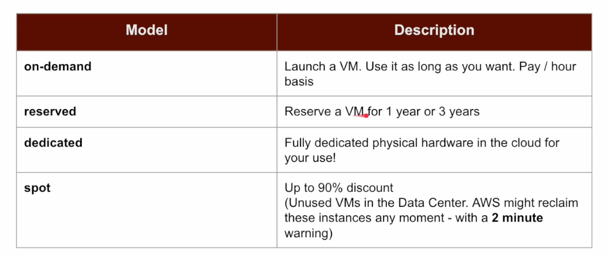
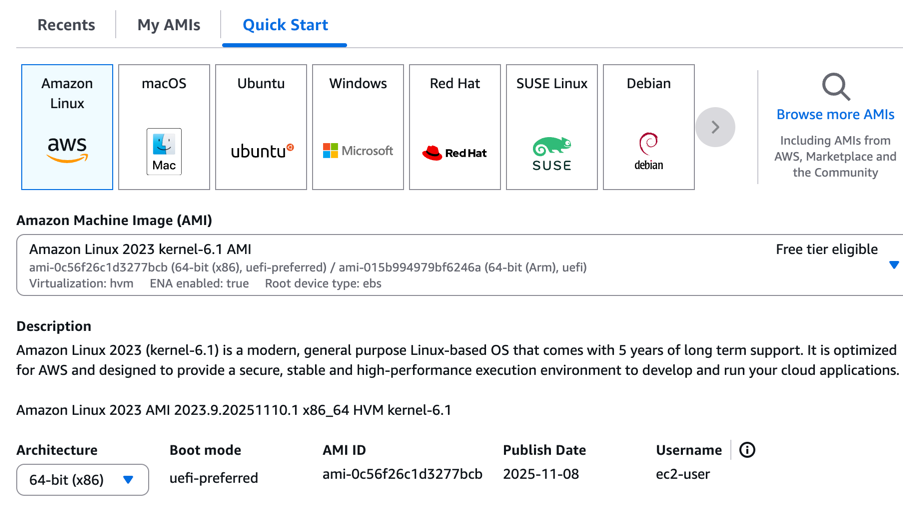
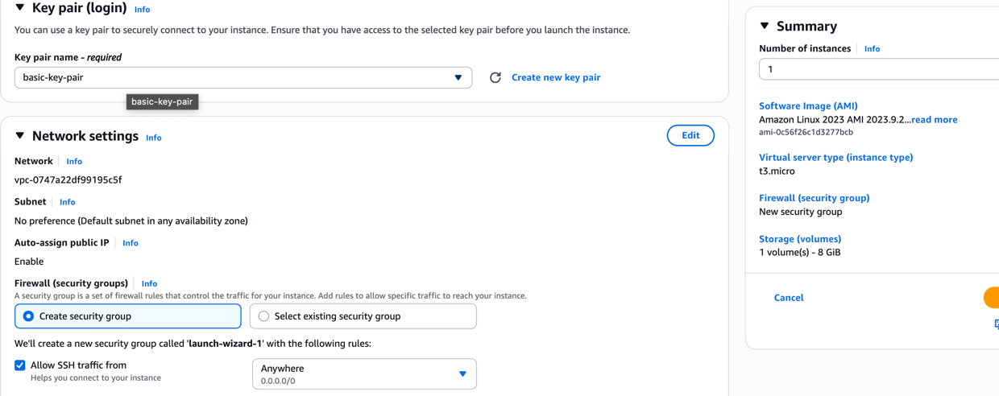
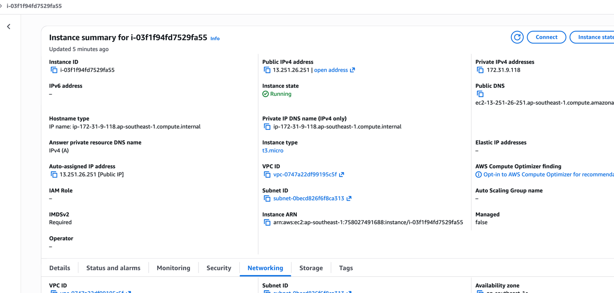
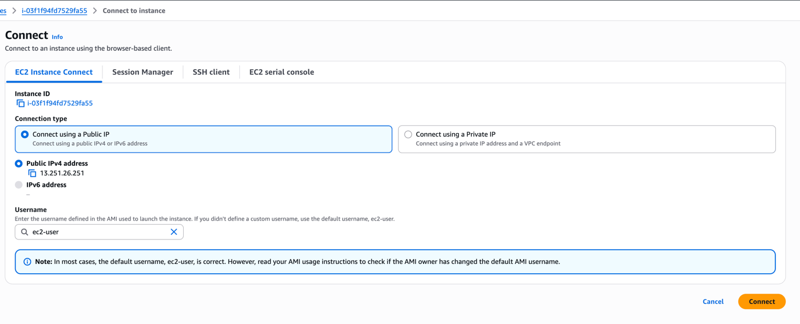
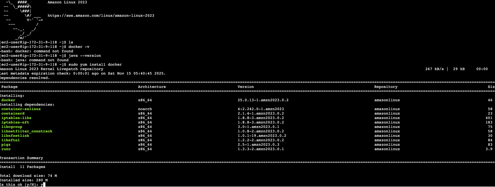
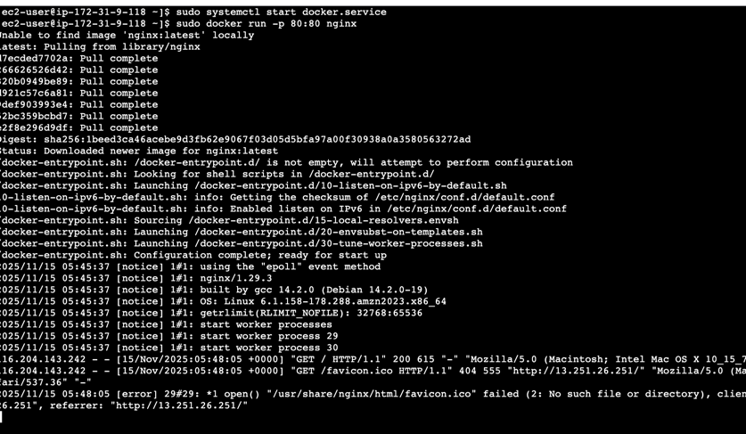
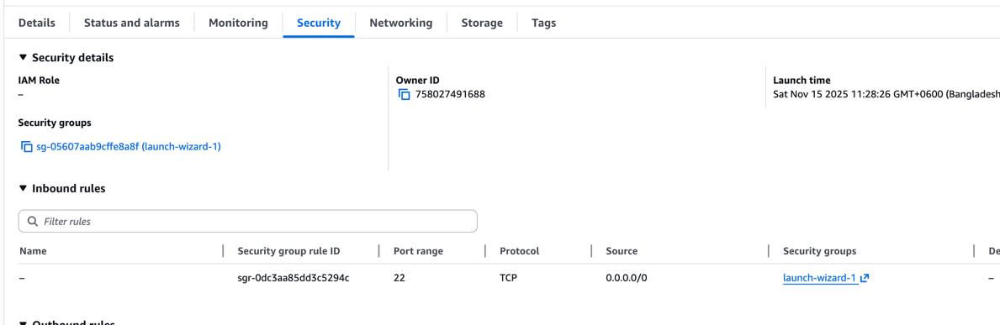
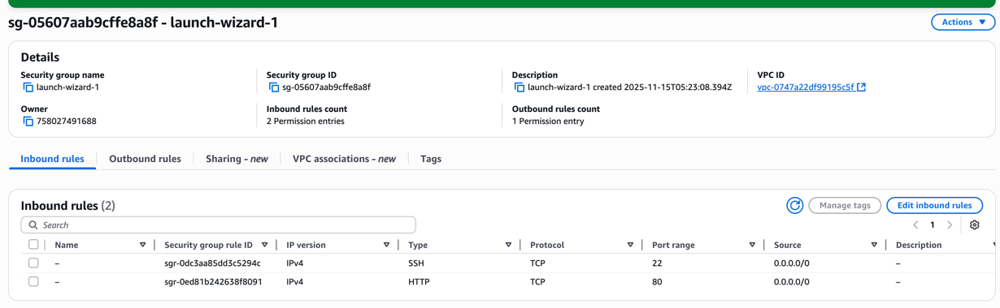
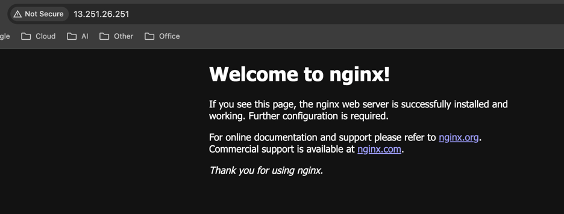

**Regions** are physical geo locations across the world where AWS
storages exist. 
**Availability zones** are data centers in the regions. They are connected
but separated with miles of distance for disaster.
**Edge locations** are close mini data centers for quick access.

## EC2 
Elastic computing cloud is adjustable and resizable virtual computers. 
There are different available services for EC2 - 

#### Let's create our first ec2 instance

Used amazon linux os, with 64 bit x86 arch, for key pair, I used one
called basic generated earlier, and for security group kept it default 0.0.0.0/0
and made accessible from anywhere. Right side shows summary of VS type and storage.

And then here is what we got - an instance running with public and private
IP addresses provided and detailed control view in the bottom.

Let's connect to our instance and play around! I could connect it from local machine too 
but let's just avoid complications for now and use AWS built in support. 

We're connected! But there is nothing installed here! Like docker, java etc.
So let's install docker and run something using docker and check whether it works.

Great! Ran NGINX on port 80, but wait! Our security group only allows port 22, so couldn't access
port 80 in the first place. Then edited the security group for this instance and added new in bound rule
with port 80 access and boom! We have something running in our EC2.
