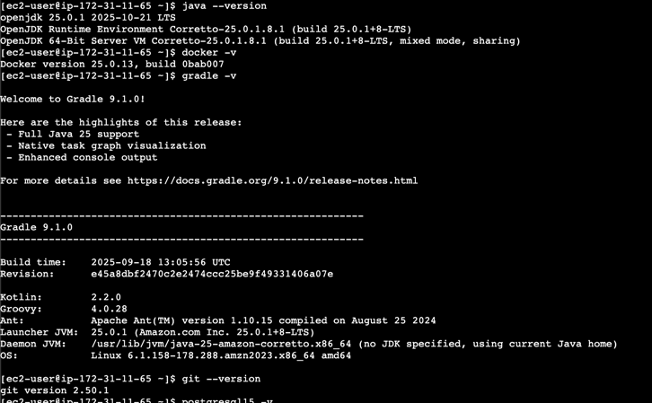
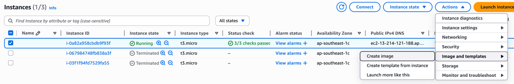
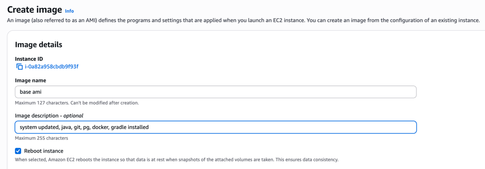
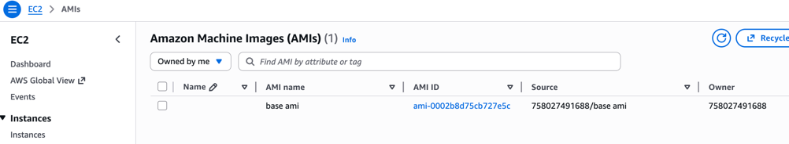
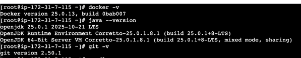

## AMI
We'll running an instance and running all those commands everytime
is boring and repeated. So what if we could make an instance, install all basic things
in it and then use that instance as a template? That's AMI (Aws machine image)!

So, created an instance, connected to it and ran these commands: 
```bash
    sudo yum update
    sudo yum install java docker postgresql15 git wget unzip -y
    sudo systemctl start docker.service 
    sudo systemctl enable docker
    sudo usermod -aG docker $USER

    # Additional: 
    curl -s "https://get.sdkman.io" | bash
    source "/home/ec2-user/.sdkman/bin/sdkman-init.sh"
    sdk install gradle 9.1.0
```
Result: We have now system updated to latest, docker, git, java, postgres and 
gradle installed and docker running with user granted access. 

Now from that instance, we're creating an AMI. 


Now we have our own AMI in the AMI section and now we can use it to create instances


It took a little longer to create but from the first moment we got our things ready.

