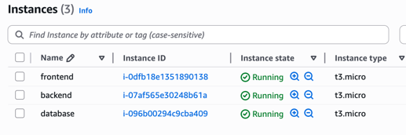
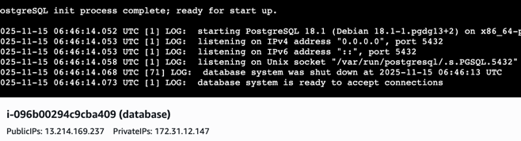
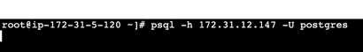
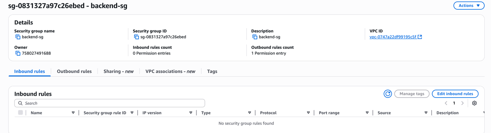
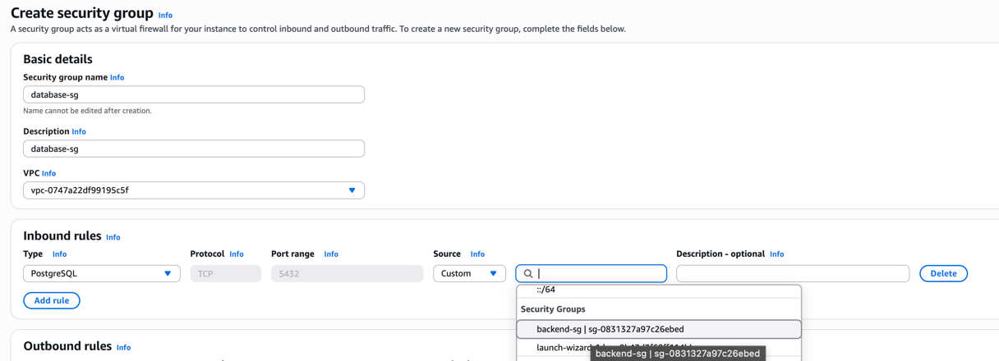
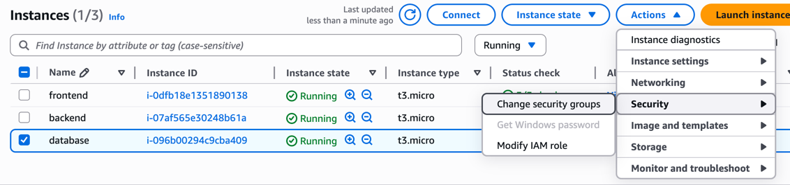
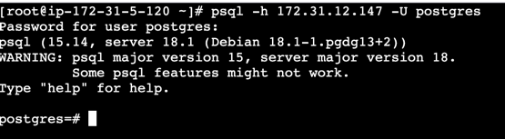
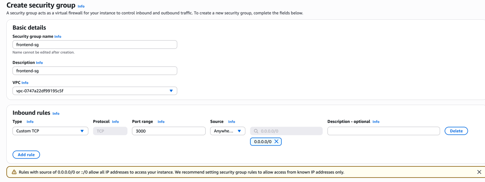
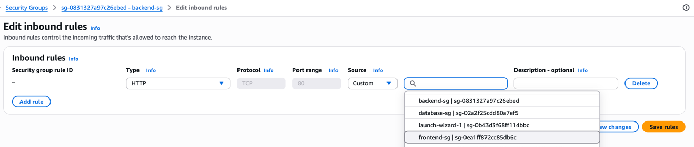
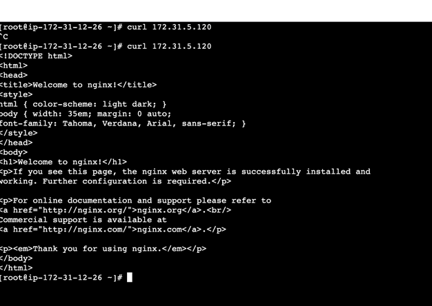

## Security groups (SG)
>An AWS Security Group acts as a virtual firewall for your Amazon Elastic Compute Cloud (EC2) instances and other AWS resources like RDS instances, controlling inbound and outbound network traffic at the instance level. 

Rules-Based Configuration: 
We can define a set of rules for both inbound (incoming) and outbound (outgoing) traffic. 
These rules specify:
- Protocol: (e.g., TCP, UDP, ICMP)
- Port Range: (e.g., port 80 for HTTP, port 443 for HTTPS)
- Source/Destination: (e.g., a specific IP address, an IP range (CIDR block), or another security group)

> Multiple Associations: An AWS resource can be assigned to multiple security groups, and an individual security group 
can be associated with multiple resources. The collective rules from all associated groups are evaluated to determine whether to allow traffic.

> Default Behavior: By default, a newly created security group denies all inbound traffic and allows all outbound traffic.

Common Use Cases
- Restricting Admin Access: Limiting SSH (port 22) or RDP (port 3389) access to specific IP addresses within your corporate network.
- Allowing Web Traffic: Permitting inbound HTTP (port 80) and HTTPS (port 443) traffic from anywhere on the internet (0.0.0.0/0) to a web server instance.
- Tiered Application Access: Allowing an application server in one security group to communicate with a database server in a separate security group over a specific port (e.g., MySQL on port 3306). 

## A real life simple scenario practice
Here is what we'll do: 
1. We'll have 3 applications: Front end, Backend, Database
2. Backend can access to database apps postgres port (5432)
3. Frontend can access to backends port 80
4. Anybody can access frontends 3000 port. 

So we'll have multiple security groups as well assigned to each with proper hierarchy.

Running all instances

Connected to db instance and ran postgres

Then connected to backend instance and tried to connect to the db but didn't work! Indefinite loading because of no permission (yet).
Also note that we're now using private IP to connect as they are in the same network. 

Created our backend SG with no inbound rules yet

Then we're creating a new security group called database-sg which allows
incoming connections from the security group backend-sg in port 5432.

Now still this doesn't allow our app to hit db because it's not assigned yet, its just a rule defined. 
So lets assign it to database and also assign the backend-sg to the backend app.

Now finally! we can hit that port of db instance from our backend instance

Now time to create front end sg

Then lets update backend sg to allow request from frontend sg

Now our frontend can hit backend on port 80 and no indefinite loading! It gets response!

And definitely we can hit our frontend port 3000 from anywhere using the public ip

> A self-referencing security group in AWS is a security group 
> rule where the source or destination of the rule is the security group's own ID. 
> This configuration allows all EC2 instances associated with that specific security 
> group to communicate with each other over the defined protocol and port(s). 
> The best use case is enabling load balancer health checks or allowing inter-tier 
> communication for services within the same application component (e.g., all web 
> servers needing to talk to each other for session replication) without needing to 
> know their individual IP addresses, making the infrastructure more dynamic and 
> easier to manage as instances scale up or down.

> User data is another feature when creating an instance. It is nothing but some commands
> that will run after the AMI/instance is ready. Some example usage of it is (we installed postgres in our AMI but didn't run docker container)
> running a docker container, installing gradle and any other bash script that may help.

