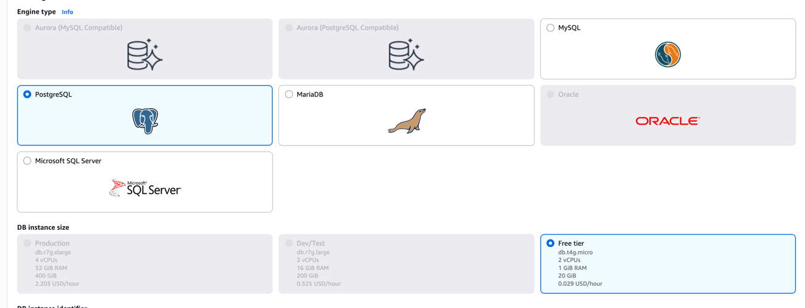
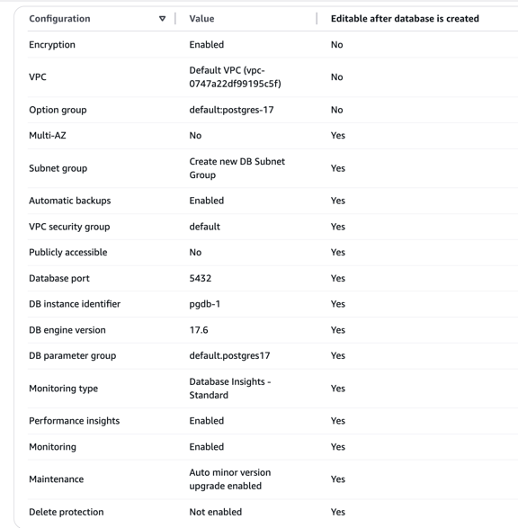
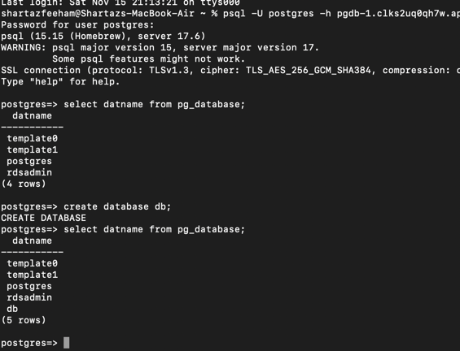
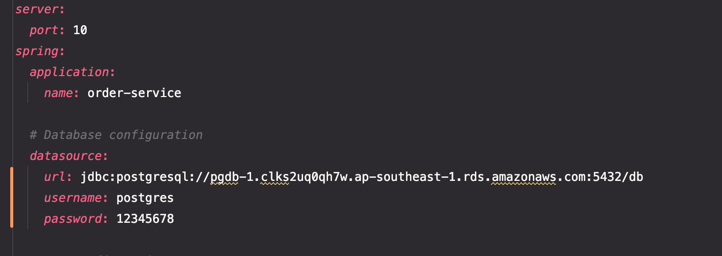
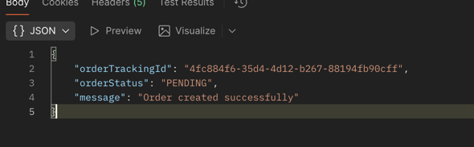
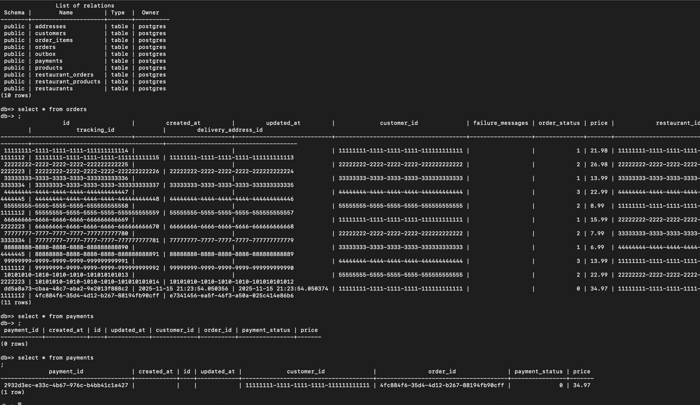

## AWS Relational Database Service (RDS)
They have many, let's go with postgres

There are many features that can be utilized

After creating the database and assigning a public security group to it,
I can access it from mac terminal:

And then tried to use the db from Clean arch practice's order service project

And it worked as well

Connected all clean arch microservices to the same db, all data seems going well

