This time selected specific availability zone: ap-southeast-1a and choose 2 instances.
So that we can deploy our temperature and humidity service in two instances running in same AZ.
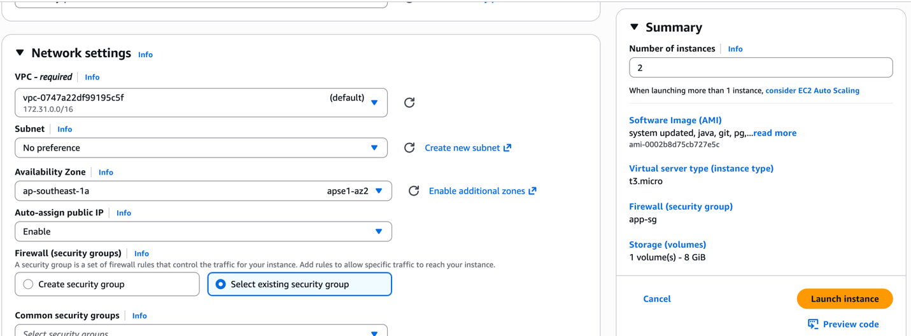

And then I created two more on **1b** AZ, so that we can cross deploy our apps
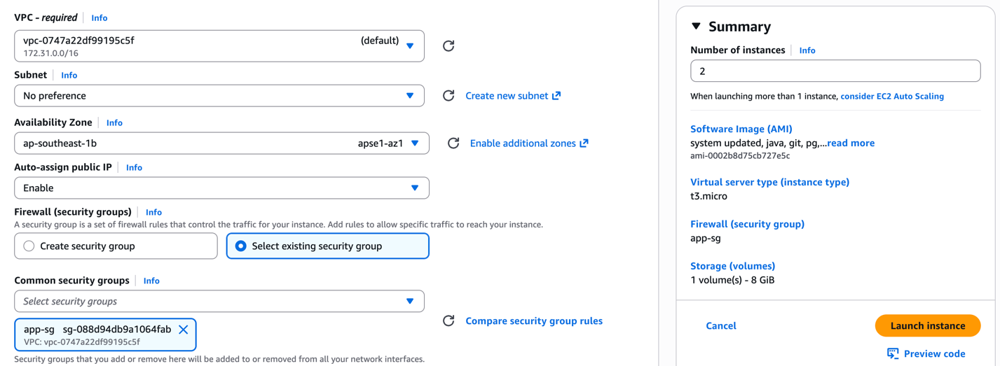

Now we're cross running our apps
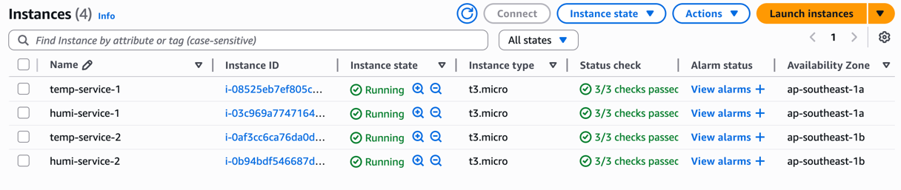

There were some build issues in my docker image so couldn't run in the first attempt.
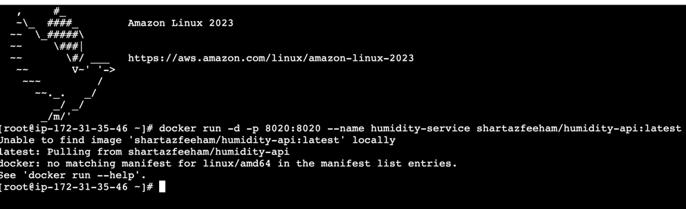

Then after building using buildX, platform miss-match issue was solved. 
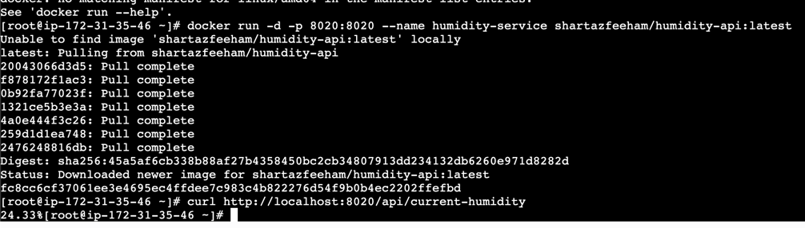
App is running and tested the curl as well. Both apps are ran, two each in two different AZ. 

Now time to group up our instances for load balancing
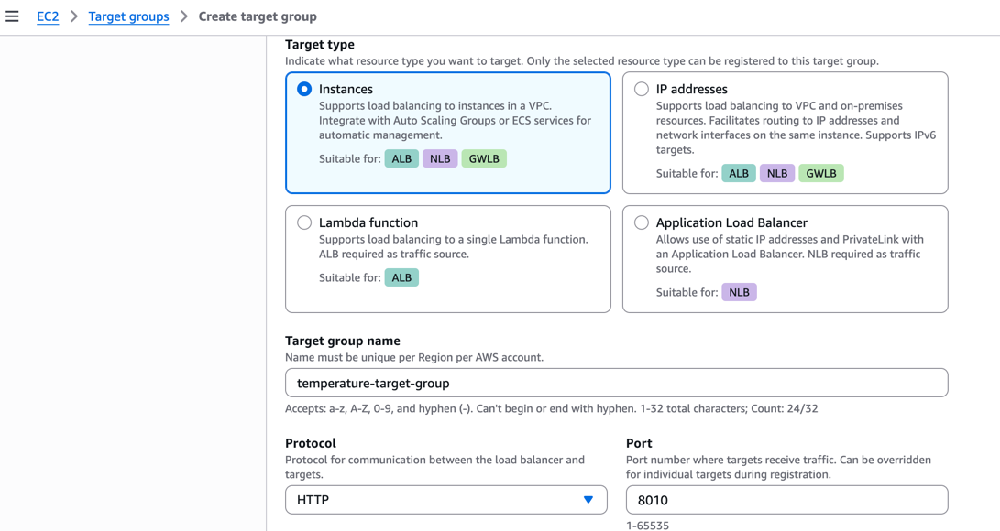

Our own health check path
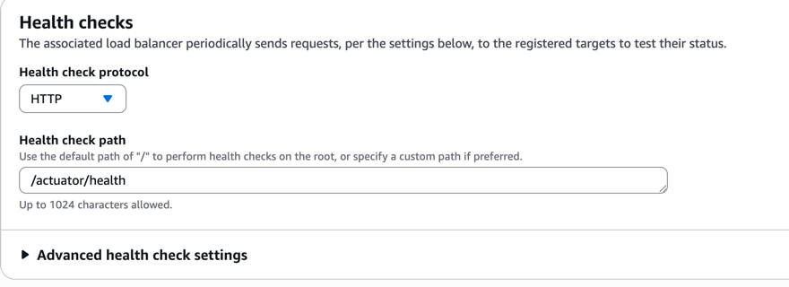

Updated the health check thresholds as well
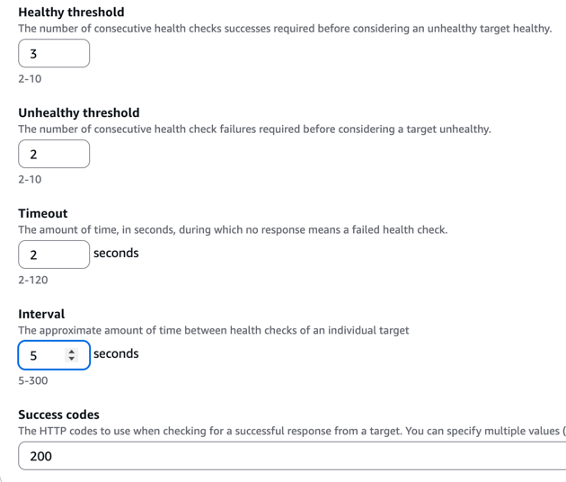

Finally select them
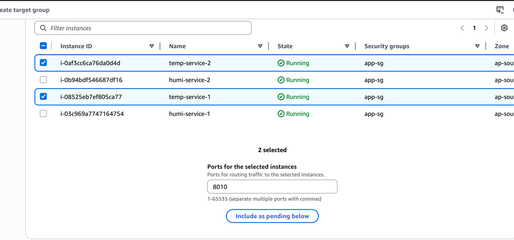

Group created
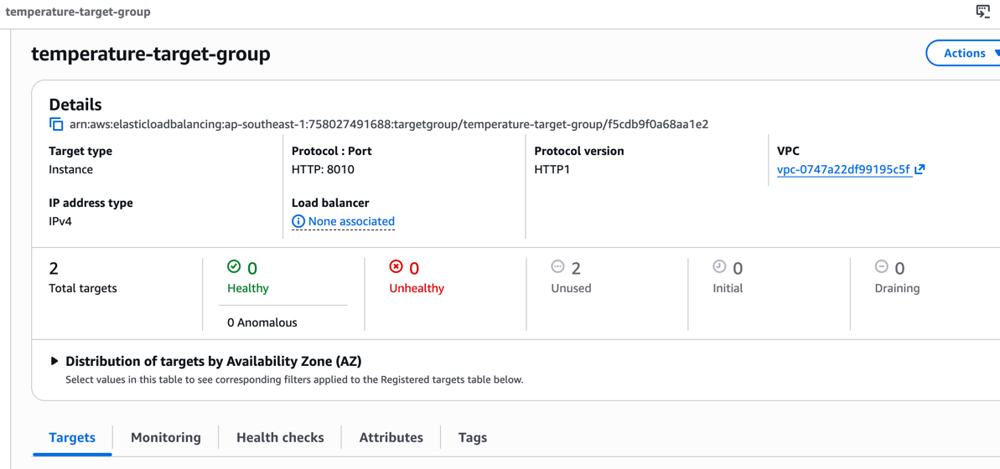

Same for humidity app
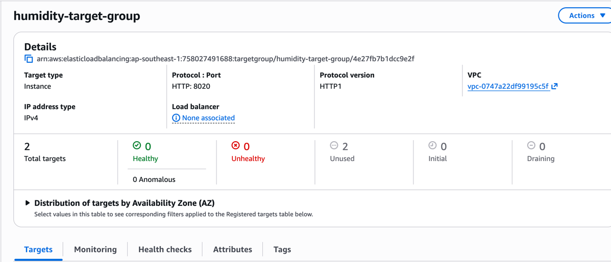

Let's create a security group for our ALB with port 80 open
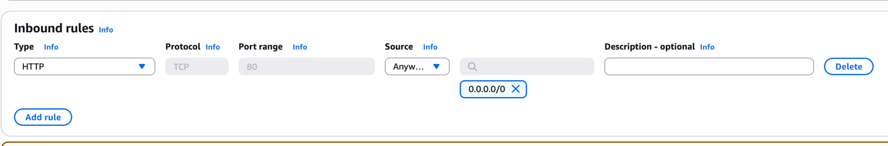

Then edited the app-sg that we used for all of our app instances, and allowed the alb-sg with differnt ports

Time to create the ALB
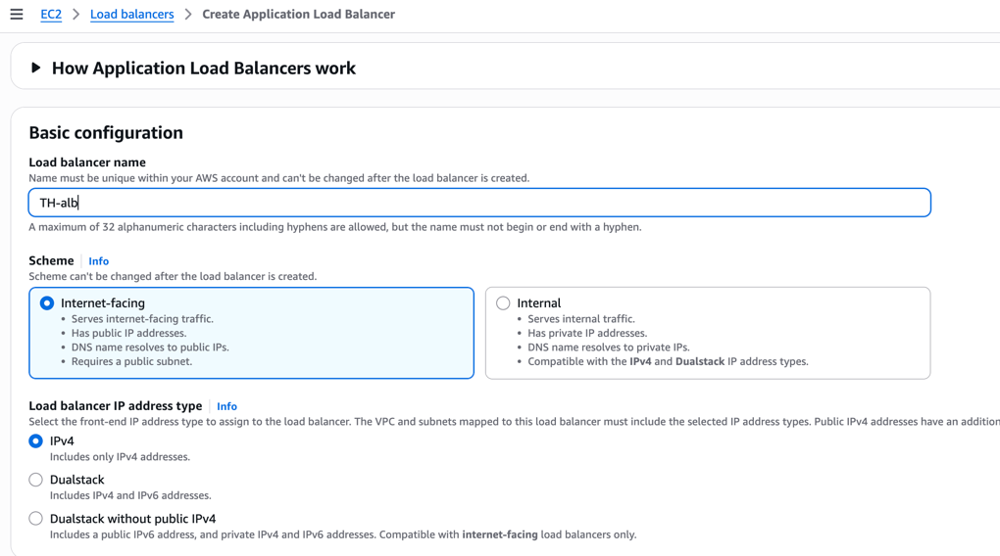

Set the availability zones and security group
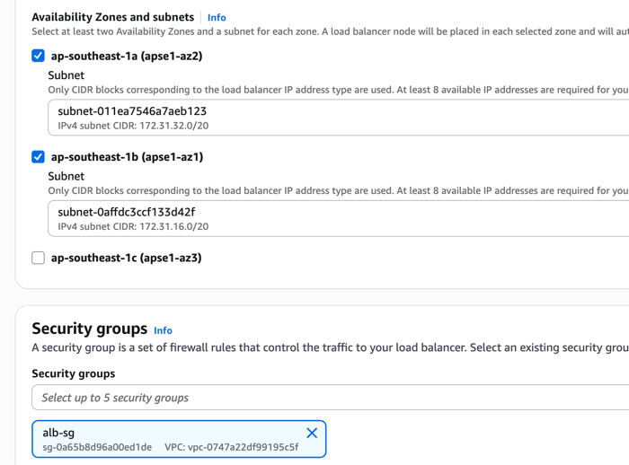

Let's edit the default behavior to 404
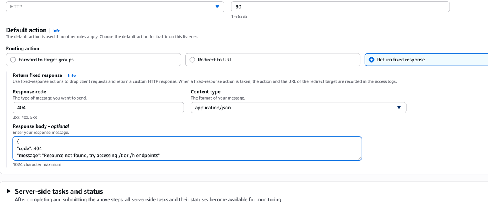

Time to add path based routing for temperature service
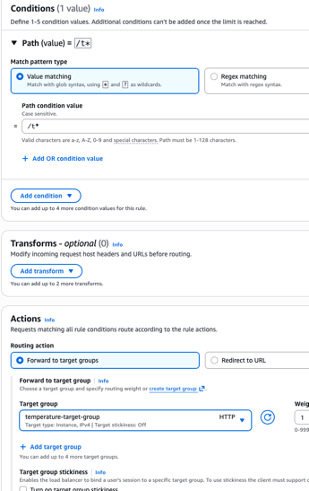

Rules are added
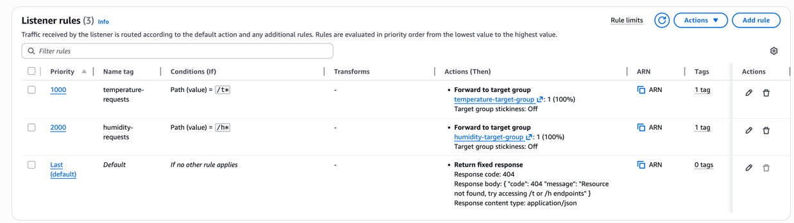

Now our target groups are shown to be healthy
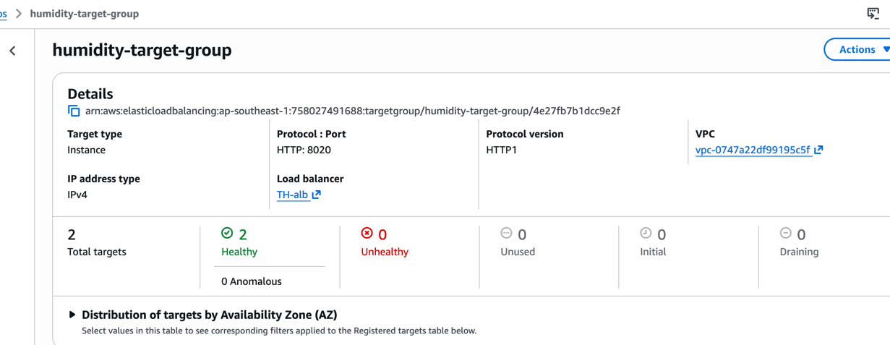

Our load balancer is running! And gave the default response for random path!
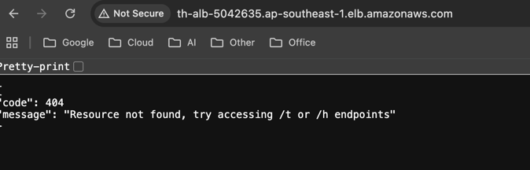

Actually I messed up the route conditions, now lets fix those
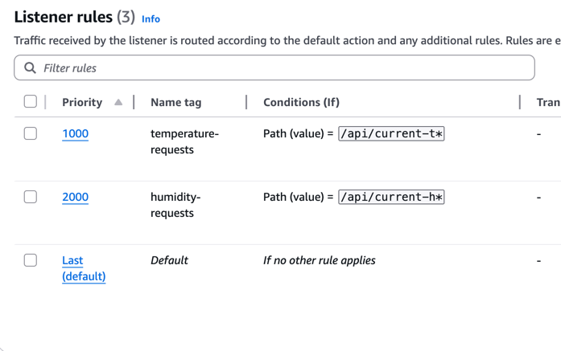

Boom! Its routing and balancing!
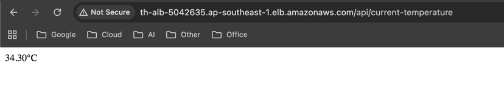
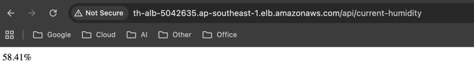

Time to test it! Let's turn down one instance of temperature service
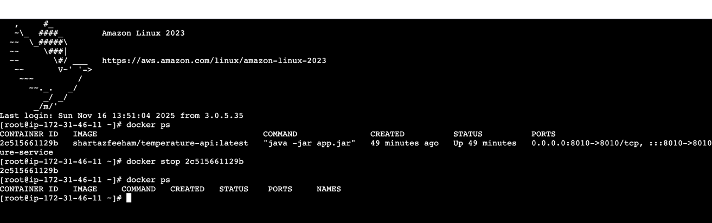

One down. May day, may day!
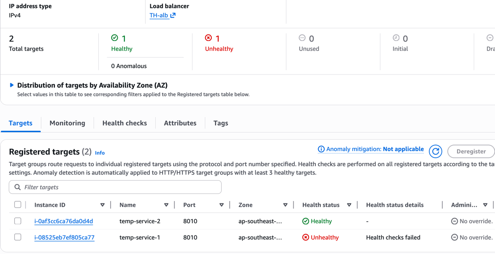

And it's still working!
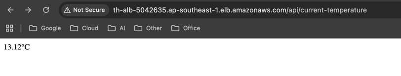

HAPPY DAY. :)