# Virtual private cloud (VPC) 

### VPC & Subnets
It does exactly what the name suggests: it creates a private network in the cloud. This network is logically isolated from other virtual networks in the cloud. we can launch your cloud resources, such as virtual machines, databases, and containers, into this VPC.

- A VPC is always created in a specific region & can not span multiple regions.
- A resource inside vpc can not be directly accessed from the internet unless we explicitly allow it.
- A VPC can have multiple subnets, each subnet can be in different availability zones (AZs) within the same region, it can be private or public, we can create instance, DB, ALB inside a subnet. An AZ can have multiple subnets.
- By default, AWS provides a default VPC in each region, where we deployed everything so far not knowing about it.
- Each region has one default vpc, each vpc has one subnet per AZ, all are public.
- So far any instance we created was inside the default VPC and as we didn't choose any subnet, those were created in default subnets as well, it's public subnet by the way otherwise we could not access them from internet.

- (Overview)

(Default VPC)
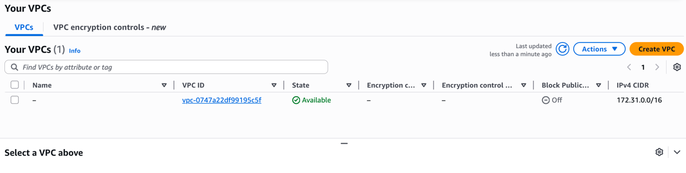
(Default subnets)

Note: these comes based on the region we select. My region is ap-southeast-1 (Singapore).

### Internet Gateway
Each subnet is isolated, when we mark it to be public, we allow both way communication between the VPC subnet and the internet. To do that we need to attach an internet gateway (IGW) to the VPC. An IGW is a horizontally scaled, redundant, and highly available VPC component that allows communication between instances in your VPC and the internet.
But who does that? Because the subnet is isolated & itself can't do that.

Internet Gateway (IGW) does that for us. Again, by default, the default VPC has an IGW attached to it.

If we detach the IGW from the VPC, all the public subnets inside that VPC will lose internet connectivity.

### Public vs Private IP addresses
If we create an instance with private IP address only then we can not connect to it. 
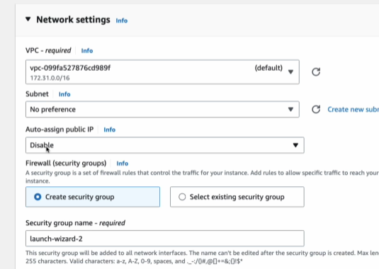
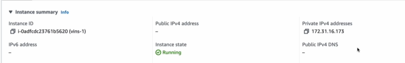
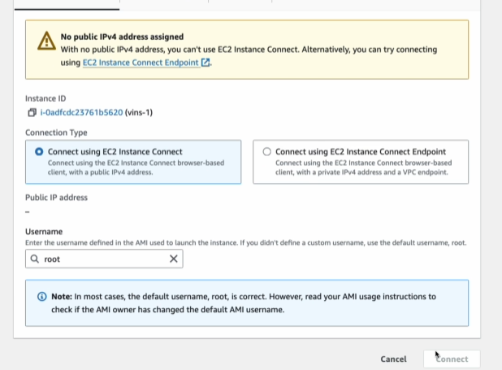
It's because to connect with one device to another, we must have a public IP address in both device. 
If one or both of them is private then they can't connect. 

### Why we need VPC? 
Well subnets can do a lots of security works but there comes a term to answer for this question. 
Defence in depth: a cybersecurity strategy that uses multiple layers of security controls to protect an organization's 
assets, ensuring that if one layer fails, others are in place to stop an attack.

### Hands on
I created a VPC in ap-s-1 zone in a and b region. There are 1 private and two public subnets in each region. 
Customized their IP addresses to 10.0.x.0 -  x is subnet number. An internet gateway is also created.

Public subnets get one public route in the route table
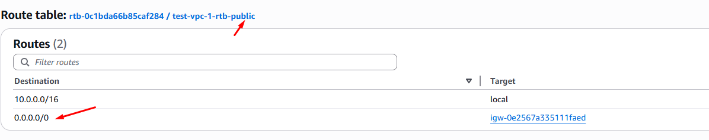
But the private ones don't. 
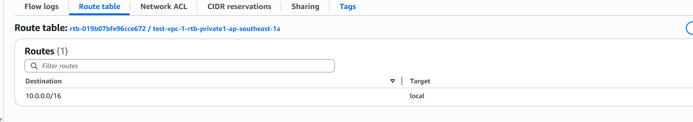
 - As the private subnets are disconnected from internet, then how can we connect to them?
 - ANS(1/1): To outside world -> private subnet, we have to first SSH into one public subnet then from it we have to SSH into the private subnet.
 - ANS(2/2): To private subnet -> outside world (internet), we have to assign a NAT gateway in each region and the subnet will use it to talk to internet. NAT gateway works exactly as our router does. My computer don't have a public IP still it can connect to internet because it asks the router and the router has a public IP. 

**Access control**
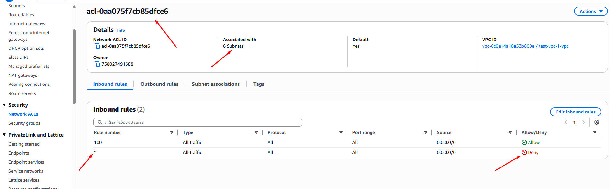
We can have more granular control over the rules from network ACL's for our VPC.

**Assigning a NAT gateway**
Created two NAT gateway like this
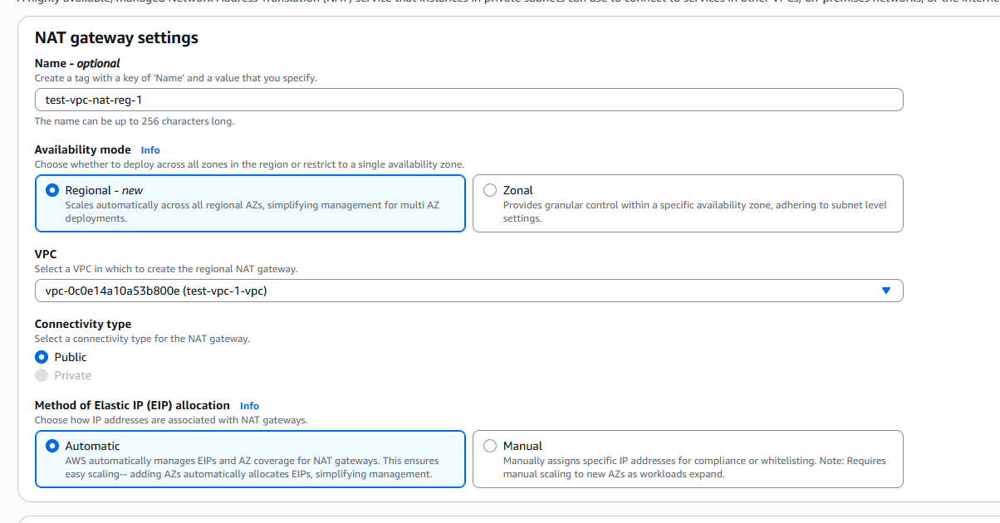
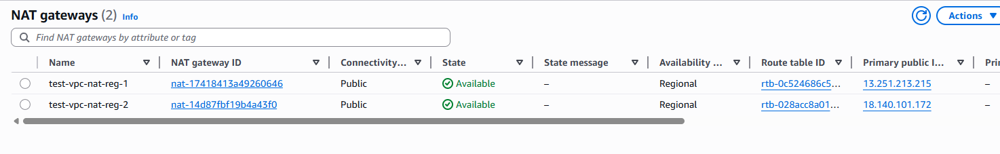
Now let's assign the gateways to subnets

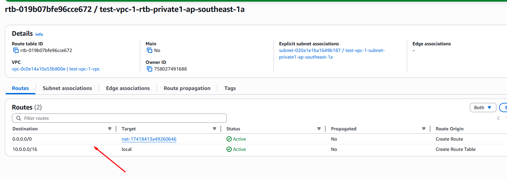
Doing it for all of our private subnets... finally our VPC looks great!
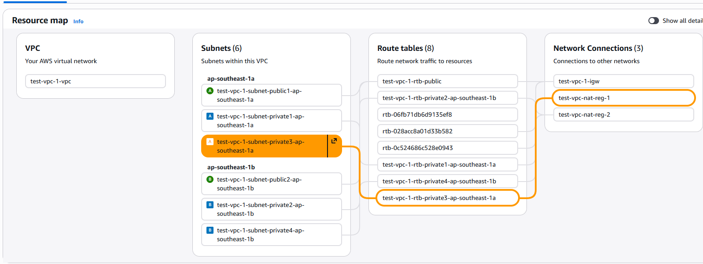

