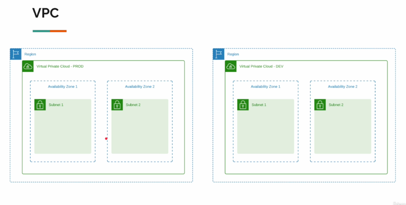
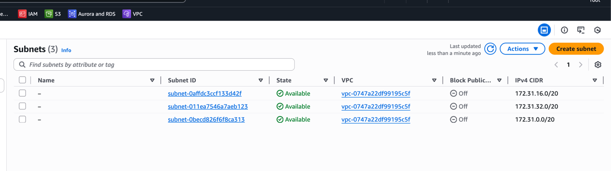
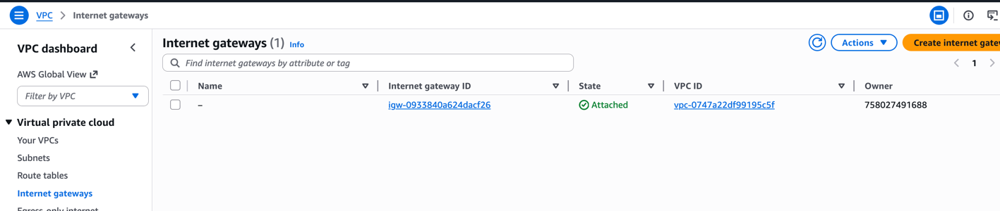

# Virtual private cloud (VPC) 

### VPC & Subnets
It does exactly what the name suggests: it creates a private network in the cloud. This network is logically isolated from other virtual networks in the cloud. we can launch your cloud resources, such as virtual machines, databases, and containers, into this VPC.

- A VPC is always created in a specific region & can not span multiple regions.
- A resource inside vpc can not be directly accessed from the internet unless we explicitly allow it.
- A VPC can have multiple subnets, each subnet can be in different availability zones (AZs) within the same region, it can be private or public, we can create instance, DB, ALB inside a subnet. An AZ can have multiple subnets.
- By default, AWS provides a default VPC in each region, where we deployed everything so far not knowing about it.
- Each region has one default vpc, each vpc has one subnet per AZ, all are public.
- So far any instance we created was inside the default VPC and as we didn't choose any subnet, those were created in default subnets as well, it's public subnet by the way otherwise we could not access them from internet.

- (Overview)

(Default VPC)

(Default subnets)

Note: these comes based on the region we select. My region is ap-southeast-1 (Singapore).

### Internet Gateway
Each subnet is isolated, when we mark it to be public, we allow both way communication between the VPC subnet and the internet. To do that we need to attach an internet gateway (IGW) to the VPC. An IGW is a horizontally scaled, redundant, and highly available VPC component that allows communication between instances in your VPC and the internet.
But who does that? Because the subnet is isolated & itself can't do that.

Internet Gateway (IGW) does that for us. Again, by default, the default VPC has an IGW attached to it.

If we detach the IGW from the VPC, all the public subnets inside that VPC will lose internet connectivity.

