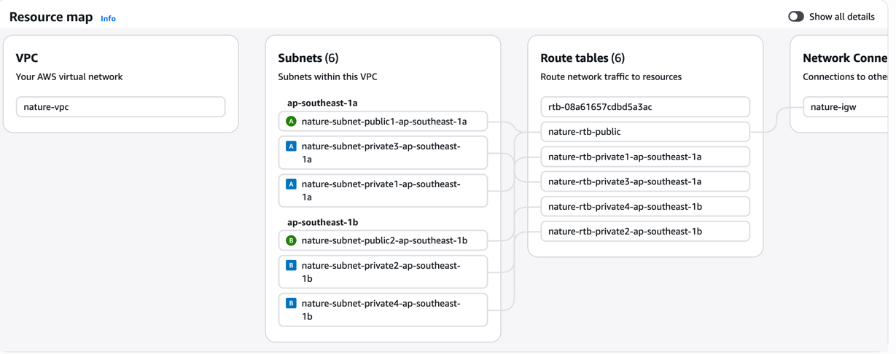
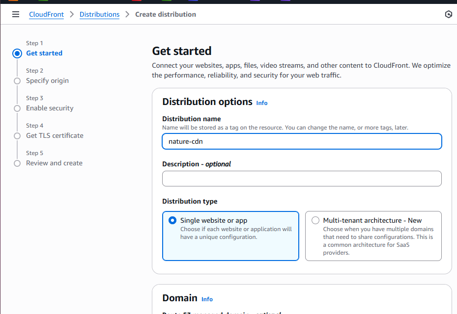
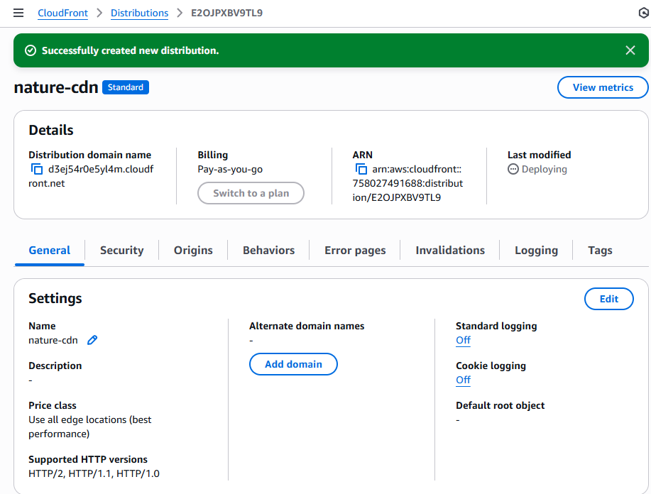
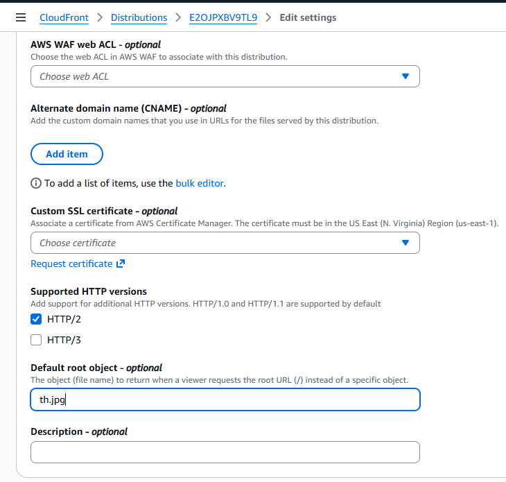
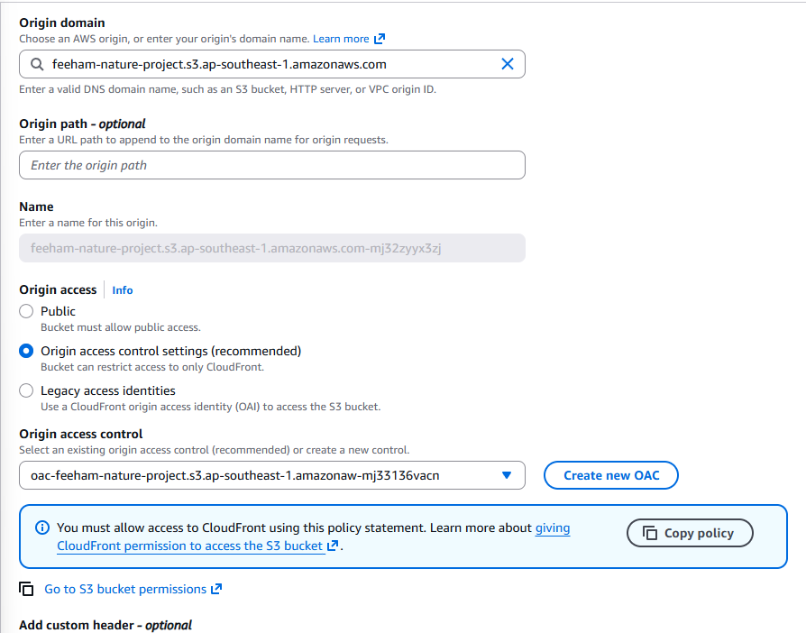
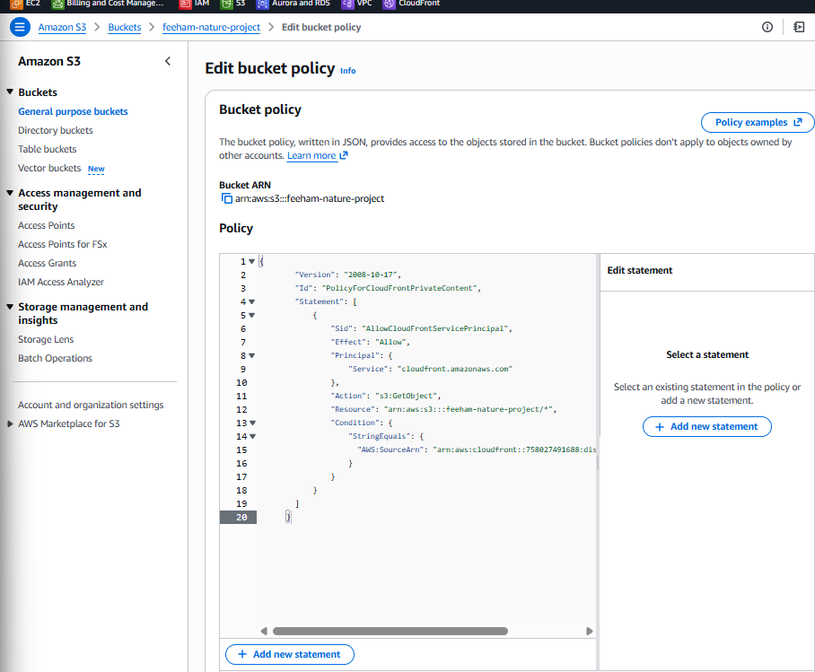
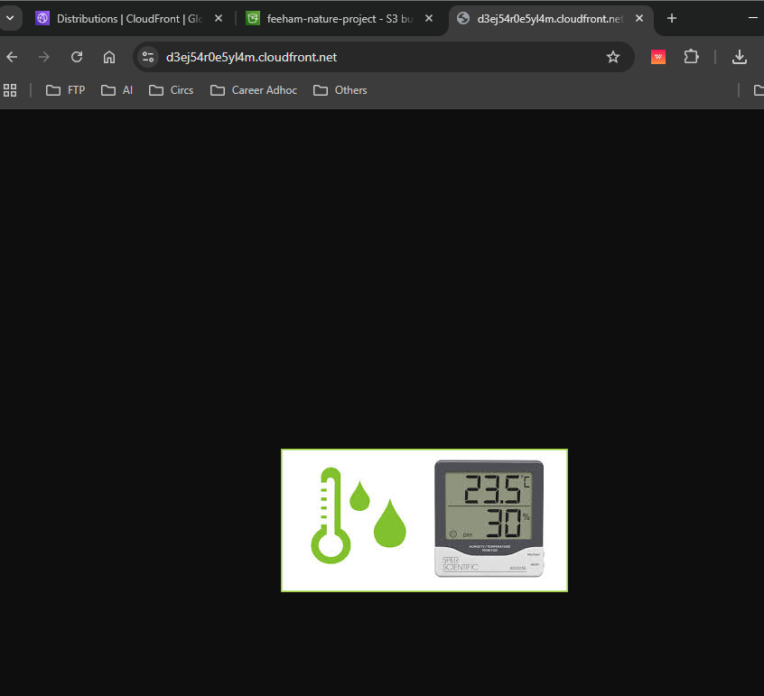
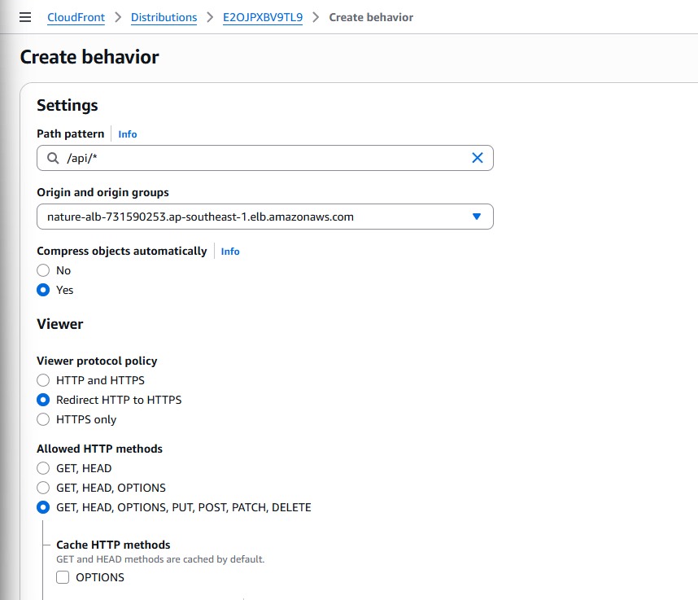
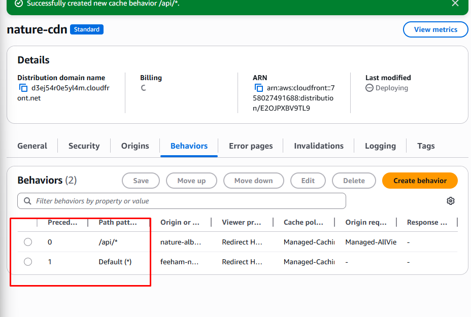
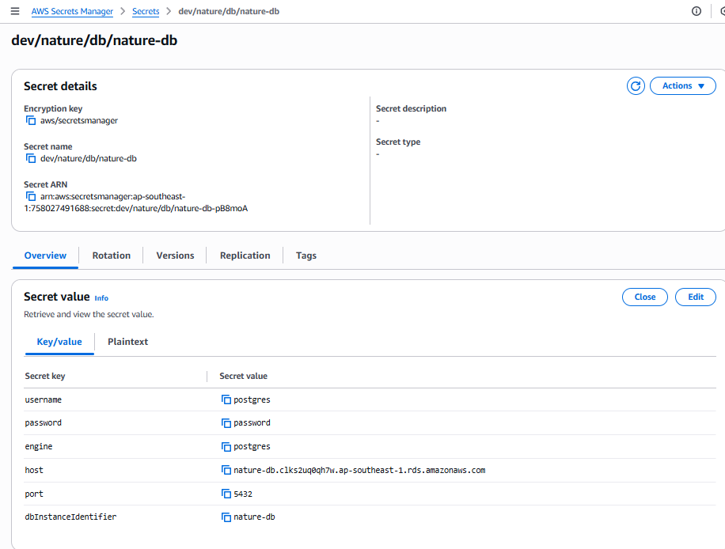

## Architecting in AWS with environment services
Current plans for the services - 

Created vpc

Here are the security groups

Need to create 3 target groups for our environment reading application

Done

Internet facing + IPV4 + Our nature vpc + Right security group and etc then done. 

And then added the path rules

Created this new S3 bucket for this practice

Now let's make a CDN

Origin is S3 and selected the bucket

It's created, now lets edit general and let's set our `th.jpg` file to be default root object

We'll disable all public access to our S3 and only CDN can access it. 
So lets edit origin and copy the policy and set it to the S3 policies. 

Boom! Its accessible through the CDN!

Till now our CDN only has one origin (S3), let's add another one - ALB.

And let's edit behavior to set routing. By default we're delivering to S3. 

Let's now create our DB subnets

Now created a new database 

As we set our DB only accessible from our app-sg so we can't access it without an app with that sg but wait, we can!
Using CloudShell. So I created a cloud shell in our nature-vpc and under a public subnet so its in the same network. 
And connected to database then created our nature database.

Time to work on Secret manager!

